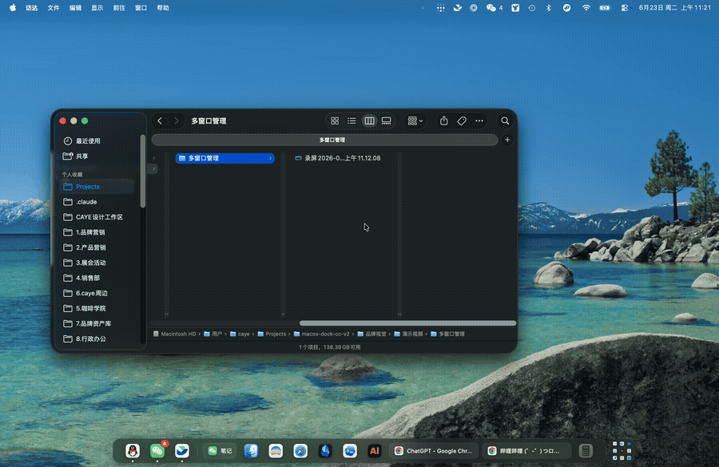
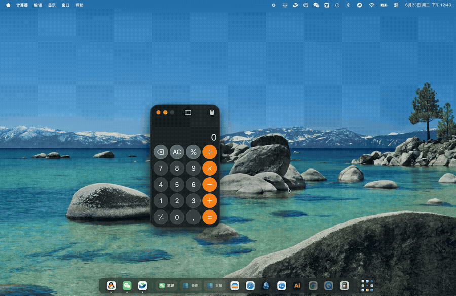
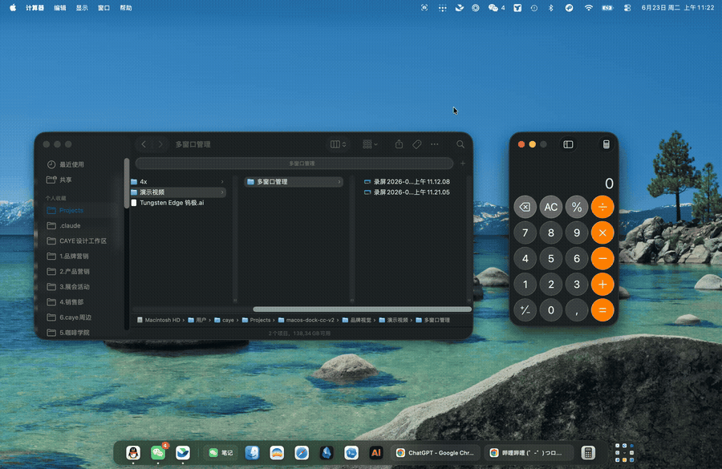

<div align="center">


# Tungsten Edge

**A per-window taskbar for macOS — switch to any window in one click, Windows-style clarity without the clutter.**

English · [中文](README.zh-CN.md)

</div>

---

## Demo

**Multi-window management**



<table>
  <tr>
    <td align="center"><b>App drawer &amp; launcher</b></td>
    <td align="center"><b>Drag to organize</b></td>
  </tr>
  <tr>
    <td></td>
    <td></td>
  </tr>
</table>

---

## What it is

Tungsten Edge puts a **per-window taskbar** at the bottom of your screen. Every open window gets its own card — just like a Windows taskbar — so you can switch directly to any window with a single click. No more hunting through stacked windows, no Mission Control, no extra gestures.

Unlike a plain Windows-style task switcher, single-window apps stay collapsed as compact icons, so the strip never gets cluttered. Multi-window apps (four Finder folders, multiple browser windows) expand into individual labeled cards. The result: the compactness of the macOS Dock combined with the per-window clarity of a Windows taskbar — without inheriting its problems.

## Features

- **Window-level taskbar** — one card per window; multi-window apps split into multiple cards; click to switch / minimize.
- **Smart native-tab merging** — apps where "tabs are windows" (Ghostty, Finder) keep a stable card while you switch tabs: it won't jump around or split.
- **Pinned messaging apps + badges** — messaging apps (WeChat, Feishu, …) get a persistent pinned entry and mirror the Dock's red unread badge.
- **App drawer** — stash rarely-used apps into a drawer on the right to keep the strip clean; pin favorites in the drawer to use it as a launcher.
- **Drag to organize** — reorder cards by dragging; drag a card into the drawer to stash it; drag it back out and it lands exactly where you drop it.
- **Menu bar controls** — the status menu controls launch at login, native Dock wake timing, and Tungsten Edge wake timing.
- **Edge auto-hide** — Tungsten Edge can hide itself and wake from the bottom edge after the delay you choose; moving away hides it again after about 0.2s.
- **Frosted-glass look** — native-grade translucency that blends into the desktop.
- **Multi-display follow** — resting the pointer on another screen's bottom edge moves the taskbar there automatically.

> **Note:** the app's interface is currently **Chinese only**. An English/localized UI is planned but not yet available — see [Roadmap](#roadmap).

## Requirements

- macOS 12.0 (Monterey) or later
- Intel and Apple Silicon (universal binary)
- On first launch you'll be asked to grant **Accessibility** permission (used to read and manage windows; the app guides you through it).

## Install

### Option 1 — download the installer (recommended)

1. Download the latest `.dmg` from [Releases](../../releases).
2. Open it and drag **Tungsten Edge** into your **Applications** folder.
3. **First launch needs to be allowed once** (this is an early, unsigned build, so macOS blocks it by default — it's not malware) — follow [First launch](#first-launch) below, then grant Accessibility permission.

### Option 2 — Homebrew (for technical users)

```bash
brew tap moonbai-studio/tungsten-edge
brew trust moonbai-studio/tungsten-edge
brew install --cask tungsten-edge
```

> The `brew trust` step is required for any third-party tap. If the first launch is blocked by macOS, allow it as described in [First launch](#first-launch) below.

## First launch

Because this is an early build that isn't Apple-notarized yet, macOS blocks it the first time with a message like "cannot be opened because it is from an unidentified developer". **This isn't malware — it's macOS's default block for any unsigned app.** Allow it once and double-clicking works normally afterward. Pick the method for your macOS version:

### Method A — right-click to open (macOS 14 and earlier)

1. Open your **Applications** folder and find **Tungsten Edge**.
2. **Right-click its icon** (or Control-click it) and choose **Open** from the menu.
3. The dialog this time has an extra **Open** button — click it.
4. Done. Double-click works from now on.

> The trick is to go through **right-click → Open**, not a plain double-click — a plain double-click only gets blocked, with no allow button.

### Method B — allow it in System Settings (macOS 15 Sequoia and newer)

Newer macOS removed right-click-to-open, so do this instead:

1. **Double-click** Tungsten Edge once; when it's blocked, **click "Done"** to dismiss the prompt (this lets the system record the attempt).
2. Open **System Settings → Privacy & Security** and scroll down to the **Security** section.
3. You'll see a line saying "Tungsten Edge was blocked…" with an **"Open Anyway"** button next to it — click it.
4. Confirm once more (you may need your login password or Touch ID). Done — double-click works from now on.

### One more step after opening: grant Accessibility permission

Tungsten Edge needs **Accessibility** permission to read and manage your windows; it guides you through this on first run:

- Open **System Settings → Privacy & Security → Accessibility**, find **Tungsten Edge**, and **turn on its switch**.

## Status menu

Tungsten Edge lives in the macOS menu bar. Its menu currently includes:

- **Launch at login** — available on macOS 13 and later. If macOS asks for approval, open Login Items in System Settings and approve Tungsten Edge there.
- **`唤醒系统 dock栏`** — adjusts the native macOS Dock wake delay. The value is saved while dragging; when you release the slider after a real change, Tungsten Edge applies it to the system Dock and restarts the Dock so it takes effect.
- **`唤醒 Tungsten Edge 钨极`** — controls how long the pointer must stay on the bottom edge before Tungsten Edge wakes. `常驻` keeps it visible, finite values run from `0.1s` to `3.0s`, and `不唤醒` keeps auto-hide but disables bottom-edge wake.

The native Dock setting requires a non-sandboxed build because macOS sandboxed apps cannot directly write the system Dock preferences or restart Dock.

## Recommended setup (align the minimize animation to the bottom)

If your native Dock lives on the **side or top** of the screen, minimizing a window flies the animation toward the native Dock — out of sync with this bottom taskbar. Move the native Dock back to the **bottom** and set it to auto-hide; the minimize animation will then shrink toward the bottom, matching Tungsten Edge:

- **System Settings → Desktop & Dock → Position on screen → Bottom**, and turn on **Automatically hide and show the Dock**.

You can then use Tungsten Edge's status menu to tune the native Dock wake delay.

## Roadmap

This is an early public build (v0.3). Known limitations and what's next:

- **Not yet signed/notarized** → first launch needs right-click → Open (above). A signed build is planned.
- **Chinese-only UI** → localization is on the roadmap. A Chinese version of this README is available at [README.zh-CN.md](README.zh-CN.md).
- Feedback and issues are very welcome.

---

## Developers

The authoritative record of engineering hand-off, design decisions, and current status lives in [`AGENTS.md`](AGENTS.md) and the author's Obsidian vault. Files under `Docs/` are dated historical findings and platform-quirk references (not a live status board).

Build & run:

```bash
./Scripts/build_and_run.sh
```
</content>
