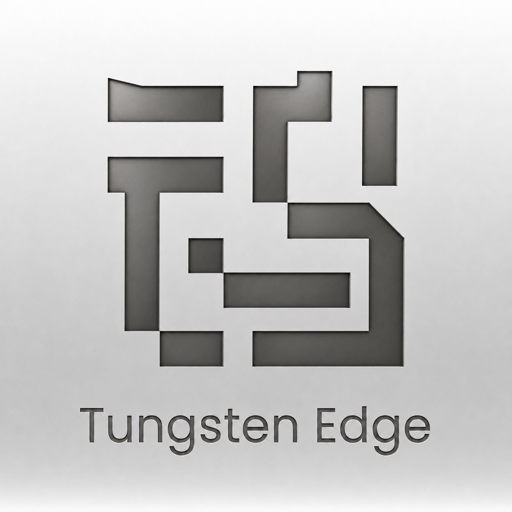

<div align="center">



# 钨极

**超轻量，前所未有的 macOS 窗口管理终极解决方案。**

[English](README.md) · 中文

</div>

---

## 这是什么

在钨极 dock 栏管理您的窗口。

## 主要功能

- **窗口级任务条**：一窗一卡，多窗口应用拆成多张卡片，点击切换 / 最小化。
- **原生标签智能合并**：Ghostty、访达这类「标签即窗口」的应用，切标签时卡片不乱跳、不分裂。
- **消息应用常驻 + 角标**：微信、飞书等消息应用有固定常驻入口，并镜像系统 Dock 的红圈未读角标。
- **应用抽屉**：不常用的应用收进右侧抽屉，保持任务条清爽；抽屉里还能固定常用应用当启动器。
- **拖拽整理**：拖动卡片排序；把卡片拖进抽屉收纳；从抽屉拖回任务条，落在你松手的精确位置。
- **磨砂玻璃质感**：原生级的毛玻璃材质，融入桌面。
- **多屏跟随**：鼠标移到哪块屏幕，任务条跟到哪块。

## 系统要求

- macOS 12.0 (Monterey) 及以上
- Intel 与 Apple 芯片均可
- 首次运行需要授予**辅助功能**权限（用于读取和操作窗口，应用会引导你开启）

## 安装

### 方式一：下载安装包（推荐普通用户）

1. 从 [Releases](../../releases) 下载最新的 `.dmg`。
2. 打开后把 **Tungsten Edge** 拖进「应用程序」文件夹。
3. **首次打开需要手动放行一次**（这是早期未签名版本，macOS 默认会拦截，不是病毒）——按下方「[首次打开 钨极](#首次打开-钨极)」操作，并开启辅助功能权限。

### 方式二：Homebrew（技术用户）

```bash
brew tap moonbai-studio/tungsten-edge
brew trust moonbai-studio/tungsten-edge
brew install --cask tungsten-edge
```

> `brew trust` 这步是必须的——Homebrew 对所有第三方 tap 都要求手动确认信任，否则直接拒绝安装。安装后若首次打开被系统拦截，按下方「首次打开 钨极」放行。

## 首次打开 钨极

因为这是早期版本、还没做苹果官方签名，macOS 第一次会拦一下，弹出「无法打开，因为它来自身份不明的开发者」之类的提示。**这不是病毒，是系统对所有未签名 App 的默认拦截。** 放行一次，以后双击就能正常开。按你的系统版本选一种做法：

### 做法一：右键打开（macOS 14 及更早）

1. 打开「应用程序」文件夹，找到 **Tungsten Edge**。
2. **在它图标上点右键**（或按住 `Control` 键点一下），在菜单里选「**打开**」。
3. 这次的弹窗里会多出一个「**打开**」按钮，点它。
4. 完成。以后直接双击即可。

> 关键是走「右键 → 打开」，而不是直接双击——直接双击只会被拦、没有放行按钮。

### 做法二：到「系统设置」里放行（macOS 15 Sequoia 及更新）

新系统取消了右键打开，改成这样：

1. 先**双击一次** Tungsten Edge，被拦下后**点「完成 / 好」关掉提示**（先让系统记下这次尝试）。
2. 打开「**系统设置 → 隐私与安全性**」，往下拉到「**安全性**」那一段。
3. 你会看到一行「已阻止 Tungsten Edge 的使用…」，**旁边有个「仍要打开」按钮**，点它。
4. 再确认一次（可能要输开机密码或指纹），完成。以后直接双击即可。

### 打开后还有一步：开启辅助功能权限

钨极要靠「辅助功能」权限来读取和管理你的窗口，第一次运行时它会引导你开启：

- 打开「**系统设置 → 隐私与安全性 → 辅助功能**」，找到 **Tungsten Edge**，**把右边的开关打开**。

## 推荐配置（让最小化动画对准底部）

如果你把系统原生程序坞放在屏幕**两侧或顶部**，最小化窗口时动画会朝原生坞的方向飞，和底部任务条的方向不一致。建议把原生程序坞移回**底部**并设为自动隐藏，最小化动画就会缩向底部、与钨极一致：

- 系统设置 → 桌面与程序坞 → 「位置」选**底部**、打开**自动隐藏**。

---

## 开发者

工程交接、设计决策与当前进度的权威记录在 [`AGENTS.md`](AGENTS.md) 与作者的 Obsidian 笔记库；`Docs/` 下是按日期归档的历史调研与平台特性记录（非实时状态板）。

构建运行：

```bash
./Scripts/build_and_run.sh
```
</content>
