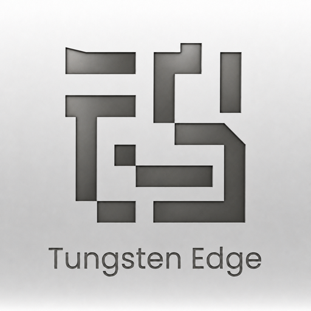
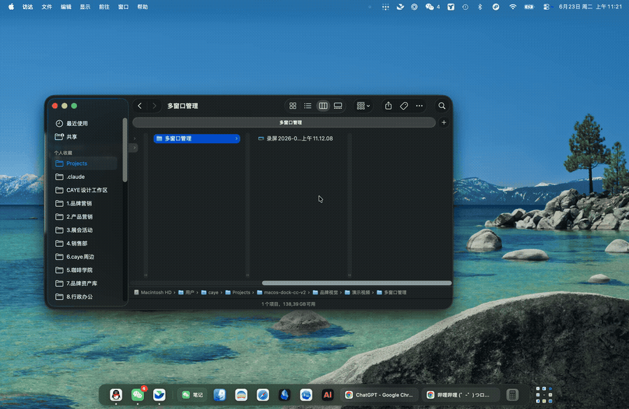
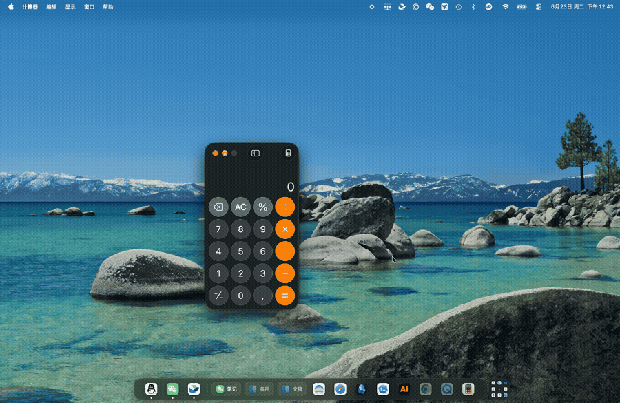
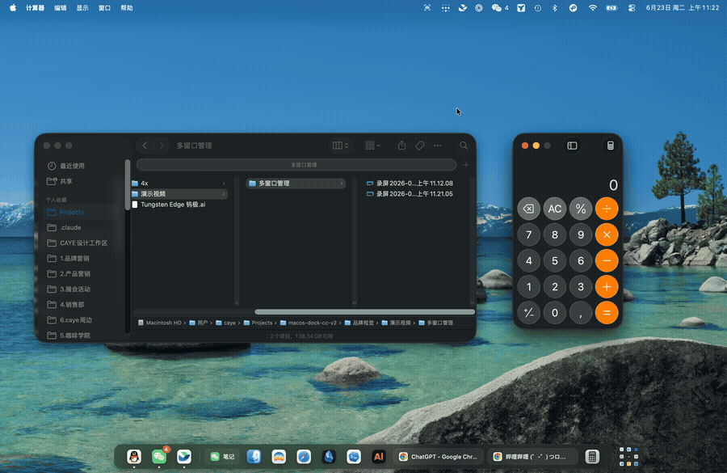

<div align="center">



# 钨极

**一窗一卡的 macOS 任务条——一键直达任意窗口，Window 式的清晰，没有它的臃肿。**

[English](README.md) · 中文

### [⬇ 下载钨极](https://tungstenedge.app)

可直接运行的安装包在[官网](https://tungstenedge.app)，本仓库存放源码。

</div>

---

## 演示

**多窗口管理**



<table>
  <tr>
    <td align="center"><b>启动台功能</b></td>
    <td align="center"><b>随意拖拽</b></td>
  </tr>
  <tr>
    <td></td>
    <td></td>
  </tr>
</table>

---

## 这是什么

钨极在屏幕底部放一条**窗口级任务条**，每个打开的窗口单独占一张卡片——就像 Windows 任务栏那样——点一下直接切换，不需要三指手势，不需要 Mission Control，不需要多余的操作。

和纯 Windows 风格不同的是：只有一个窗口的应用以图标形式压缩显示，任务条不会被撑满。四个访达窗口、多个浏览器窗口的应用才展开成多张卡片。结果是：macOS Dock 的紧凑 + Windows 任务栏的窗口清晰，两者的优点，没有各自的问题。

## 主要功能

- **窗口级任务条**：一窗一卡，多窗口应用拆成多张卡片，点击切换 / 最小化。
- **原生标签智能合并**：Ghostty、访达这类「标签即窗口」的应用，切标签时卡片不乱跳、不分裂。
- **消息应用常驻 + 角标**：微信、飞书等消息应用有固定常驻入口，并镜像系统 Dock 的红圈未读角标。
- **应用抽屉**：不常用的应用收进右侧抽屉，保持任务条清爽；抽屉里还能固定常用应用当启动器。
- **拖拽整理**：拖动卡片排序；把卡片拖进抽屉收纳；从抽屉拖回任务条，落在你松手的精确位置。
- **菜单栏与设置窗口**：状态栏菜单管随手要切的（登录时启动、系统 Dock 与钨极各自的唤醒时间）；外观类偏好（显示中转站、悬停显示应用名、最大化避让、任务条大小）都在设置窗口里。
- **边缘自动隐藏**：钨极可以自动隐藏；鼠标停在屏幕底边达到设定时间后唤醒，离开后约 `0.2s` 再隐藏。
- **磨砂玻璃质感**：原生级的毛玻璃材质，融入桌面。
- **多屏跟随**：鼠标在另一块屏幕底边停留后，任务条会自动切到那块屏幕。
- **原生全屏无闪烁**：使用标准绿灯或 `Control-Command-F` 进入全屏前，钨极会先把自己的面板移出转场快照。此功能默认开启，可在设置中关闭。

## 系统要求

- macOS 12.0 (Monterey) 及以上
- Intel 与 Apple 芯片均可
- 首次运行需要授予**辅助功能**权限（用于读取和操作窗口，应用会引导你开启）

### 全局输入监听说明

切进原生全屏时，任务条会被系统的过渡快照抓到、闪烁一帧。要消除它，钨极必须在你的输入送达目标应用之前就把任务条藏起来，因此会监听全局的**鼠标左键按下、键盘按下和触控板手势**，只识别下面四种：

- 标准窗口绿灯
- 精确的 `Control-Command-F`
- `Control-左右方向键`（切换到相邻的全屏空间时）
- 三指水平滑动（同上）

普通输入不会被记录、写入日志、修改或发送到任何地方。监听默认开启；在设置的「高级」里关闭「预测全屏切换，消除任务条闪烁」后，这些监听会被完全停用。

macOS 在密码框等场景启用 Secure Input 时，不会把键盘事件交给全局 event tap，因此这段时间无法提前识别全屏快捷键；绿灯与触控板手势不受影响。

## 安装

### 方式一：下载安装包（推荐普通用户）

1. 从[官网](https://tungstenedge.app)下载最新的 `.dmg`。
2. 打开后把 **Tungsten Edge** 拖进「应用程序」文件夹。
3. 双击打开即可。首次运行时按提示开启**辅助功能**权限（见下方「[开启辅助功能权限](#开启辅助功能权限)」）。

### 方式二：Homebrew（技术用户）

```bash
brew tap moonbai-studio/tungsten-edge
brew trust moonbai-studio/tungsten-edge
brew install --cask tungsten-edge
```

> `brew trust` 这步是必须的——Homebrew 对所有第三方 tap 都要求手动确认信任，否则直接拒绝安装。

## 开启辅助功能权限

钨极从 **v0.9.0 起已通过 Apple 签名与公证**，双击就能打开，不再需要右键放行。

打开后还有一步：钨极要靠「辅助功能」权限来读取和管理你的窗口，第一次运行时它会引导你开启：

- 打开「**系统设置 → 隐私与安全性 → 辅助功能**」，找到 **Tungsten Edge**，**把右边的开关打开**。

> **从 v0.8.0 及更早版本升级上来的用户注意**：v0.9.0 换成了正式的开发者签名，系统会把它
> 当成一个「新的」App，旧的辅助功能授权不再生效。请先**退出钨极**，在辅助功能列表里
> **选中旧的 Tungsten Edge 条目、点「−」删掉**，再重新打开钨极并按引导重新授权。
> 只需要做这一次，以后升级不用再来。

## 状态栏菜单与设置窗口

设置分两处，这个划分是有意的：**状态栏菜单**只放需要随手切的东西，其余全在**设置窗口**里。

### 状态栏菜单

- **登录时启动**：macOS 13 及以上可用。如果系统显示需要批准，请打开系统设置里的登录项并批准钨极。
- **Tungsten Edge 钨极（⌥⇧⌘D 显隐）**：这是一条灰色的分组标题，不可点击。它下面是钨极自己的唤醒时间滑杆：`常驻`、`0.1s`–`3.0s` 或 `不唤醒`。全局快捷键 `⌥⇧⌘D` 在「常驻」和你上一次设的自动隐藏延迟之间切换——它是在系统 Dock 的 `⌥⌘D` 上加了 Shift，同时把原来的 `⌥⌘E` 释放回 Safari 和访达。快捷键注册失败时，菜单只是不再显示这个提示。
- **系统 Dock（⌥⌘D 显隐）**：同样是分组标题。`⌥⌘D` 归 macOS 所有，所以这里只把它写成文字，不占用这个快捷键。下面的滑杆调的是**原生 Dock** 的唤醒时间（`常驻`、`0.1s`–`3.0s`、`不唤醒`——拖到 `不唤醒` 就是彻底收起，鼠标碰到底边也不会弹出）。拖动只是暂存草稿并浮出一行确认，按下确认才真正写入：每次写入都要重启 Dock、屏幕会闪一下，所以不让它在拖动过程中反复发生。
- **打开系统 Dock 设置…**：打开系统设置里的 Dock 配置页（Ventura 及以上为「桌面与程序坞」，macOS 12 为「程序坞与菜单栏」）。它只负责跳转，不写偏好、不重启 Dock。
- **设置…**：打开下面说的设置窗口。
- **检查更新…**：手动检查最新正式版本。发现新版本时会直接给出更新窗口，点一下就自动下载、安装并重启，不用再去官网手动下载和拖动。

### 设置窗口

从状态栏菜单的**设置…**打开，或者**右键点任务条右端的抽屉胶囊**。（正常使用时 `⌘,` 是没用的：钨极是菜单栏应用，自己没有菜单栏可以挂这个快捷键。）

- **通用**：登录时启动。
- **任务条**
  - **显示中转站**：控制中转站图标显不显示。取消勾选只是把图标藏起来，已暂存的文件引用照旧保留，勾回来还在。注意：中转站关掉**而且**一个固定文件夹都没有时，整个文件夹区会消失，任务条上就没有拖文件进来的落点、也没有「添加文件夹…」入口了——勾回中转站即可恢复。
  - **鼠标悬停显示应用名**：关掉之后，鼠标划过任务条不再冒出应用名气泡。
  - **最大化窗口避开任务条**：把铺满屏幕的窗口底边抬到任务条上方。这会改动其他应用的窗口尺寸，所以默认关闭。
  - **任务条大小**：小 / 中 / 大 / 特大四档，任务条和右侧胶囊一起缩放——图标、文字、间距、圆角和条高都跟着走。默认是「中」，与真实 Dock 的条高一致。换档瞬时生效；打开着的抽屉会先关掉，好按新尺寸重新测量。抽屉内部内容和文件夹 / 中转站弹窗维持原尺寸不缩放。
- **高级**：**预测全屏切换，消除任务条闪烁**（默认开启；它到底监听什么，见上面的[全局输入监听说明](#全局输入监听说明)）。
- **关于**：版本号、检查更新、**自动检查更新**（默认开启；关掉之后钨极不再定期联网查新版本，只有你点「检查更新…」时才查），以及原始用户邮箱订阅。

写入系统 Dock 偏好需要非沙箱版本，因为沙箱应用不能写 Dock 偏好或重启 Dock；打开系统设置页本身不受此限制。

## 推荐配置（让最小化动画对准底部）

> 首次运行、且系统 Dock 还没设成自动隐藏时，钨极会主动弹一次引导问你要不要帮忙隐藏，
> 点一下就好。已经隐藏过的人不会看到它。下面这段是手动做法，以及引导之外的其它建议。


如果你把系统原生程序坞放在屏幕**两侧或顶部**，最小化窗口时动画会朝原生坞的方向飞，和底部任务条的方向不一致。建议把原生程序坞移回**底部**并设为自动隐藏，最小化动画就会缩向底部、与钨极一致：

- 系统设置 → 桌面与程序坞 → 「位置」选**底部**、打开**自动隐藏**。

想让原生 Dock 彻底不再出现，把菜单里系统 Dock 那条滑杆拖到 `不唤醒`：此时鼠标停在底边也不会唤醒它。

## 社区

**微信交流群**


二维码每周更新。若扫码提示已过期，欢迎到 [Issues](https://github.com/moonbai-studio/tungsten-edge/issues) 留言，我会尽快换新。

钨极认可并感谢 [LINUX DO](https://linux.do/) 社区提供的交流与反馈。

## 许可证

Copyright (C) 2026 Moonbai Studio.

钨极采用 GNU General Public License v3.0 或更高版本（`GPL-3.0-or-later`）授权，详见 [LICENSE](LICENSE)。

应用源码、构建脚本和完成构建所需的资产均公开在本仓库中。代码签名证书、公证凭据、账号凭据和其他秘密信息不属于源码，也不会提交到仓库。

该许可证覆盖源码，但不要求官方签名公证版或相关服务必须免费提供。

---

## 开发者

每个版本的发布说明归档在 [`Docs/Archive/Releases/`](Docs/Archive/Releases)。

构建运行：

```bash
./Scripts/build_and_run.sh
```
</content>
