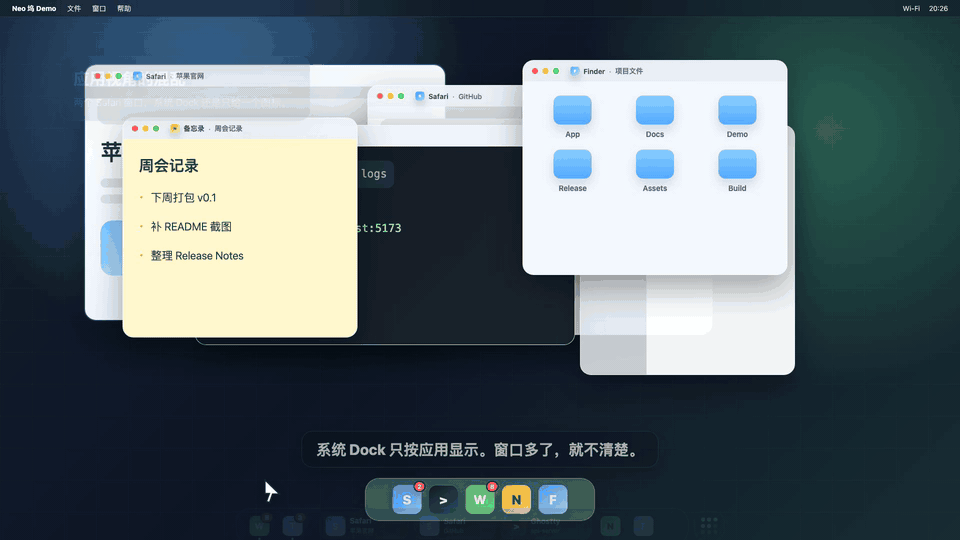

<div align="center">


# 钨极

**以窗口为单位的 macOS Dock 栏——一键直达任意窗口，Windows 式的清晰，没有它的臃肿。**

[English](README.md) · 中文

### [⬇ 下载钨极](https://tungstenedge.app)

可直接运行的安装包在[官网](https://tungstenedge.app)，本仓库存放源码。

</div>

---

## 演示



---

## 这是什么

窗口一多，每个 Mac 用户都会遇到同一件事：想回到刚才那个窗口，得先找。点 Dock 图标，所有窗口一起弹到脸上；右键有个窗口列表，但每次都得点开、找到、再选，顺序还不固定。用过 Windows 的人知道，这件事本可以只是「看一眼、点一下」。

苹果不是没意识到：Mission Control、台前调度，都是他们的答案——只是它们整理的是桌面，不是你的切换动作。钨极走的是另一条路：把「每个窗口一步可达」带到 macOS 底部。

- **窗口为单位**：每个窗口在 Dock 栏上有自己的一张卡片，点一下直达；只开一个窗口的应用折叠成图标，不臃肿；最小化的窗口，卡片留在原位等你。
- **切换逻辑准**：点击就有正确回应——该唤醒的唤醒，该最小化的最小化；卡片不乱跳、不闪烁、不冒幽灵窗口。用过同类工具的人知道，这些不是理所当然——窗口识别是钨极最下功夫的核心工程。
- **原生又轻量**：原生 Swift 打造，不是网页套壳；毛玻璃融进桌面，动画拖拽全程跟手；为全天常驻设计，安静待在底边不打扰。

抽屉收纳、消息应用角标、固定文件夹、多屏跟随、全屏无闪烁——也都在，见下方功能清单。

## 主要功能

- **窗口级 Dock 栏**：一窗一卡，多窗口应用拆成多张卡片，点击切换 / 最小化。
- **原生标签智能合并**：Ghostty、访达这类「标签即窗口」的应用，切标签时卡片不乱跳、不分裂。
- **消息应用常驻 + 角标**：微信、飞书等消息应用有固定常驻入口，并镜像系统 Dock 的红圈未读角标。
- **应用抽屉**：不常用的应用收进右侧抽屉，保持 Dock 栏清爽；抽屉里还能固定常用应用当启动器。
- **拖拽整理**：拖动卡片排序；把卡片拖进抽屉收纳；从抽屉拖回 Dock 栏，落在你松手的精确位置。
- **菜单栏与设置窗口**：状态栏菜单管登录时启动、系统 Dock 与钨极各自的唤醒时间，以及调外观时随手要切的几项（显示在哪块屏、Dock 栏大小、显示中转站、悬停显示应用名、最大化避让）；语言、快捷键、反馈、授权和检查更新在设置窗口里。
- **边缘自动隐藏**：钨极**默认常驻**；也可以设成自动隐藏——鼠标停在屏幕底边达到设定时间后唤醒，离开后约 `0.2s` 再隐藏。档位在状态栏菜单的钨极滑杆上调，`⌥⇧⌘D` 在常驻和上次的自动隐藏档之间切换。
- **磨砂玻璃质感**：原生级的毛玻璃材质，融入桌面。
- **多屏跟随**：鼠标在另一块屏幕底边停留后，Dock 栏会自动切到那块屏幕。
- **原生全屏无闪烁**：使用标准绿灯或 `Control-Command-F` 进入全屏前，钨极会先把自己的面板移出转场快照。此功能默认开启，可在设置中关闭。

## 系统要求

- macOS 12.0 (Monterey) 及以上
- Intel 与 Apple 芯片均可
- 首次运行需要授予**辅助功能**权限（用于读取和操作窗口，应用会引导你开启）

### 全局输入监听说明

切进原生全屏时，Dock 栏会被系统的过渡快照抓到、闪烁一帧。要消除它，钨极必须在你的输入送达目标应用之前就把 Dock 栏藏起来，因此会监听全局的**鼠标左键按下、键盘按下和触控板手势**，只识别下面四种：

- 标准窗口绿灯
- 精确的 `Control-Command-F`
- `Control-左右方向键`（切换到相邻的全屏空间时）
- 三指水平滑动（同上）

普通输入不会被记录、写入日志、修改或发送到任何地方。监听默认开启；在设置的「高级」里关闭「预测全屏切换，消除 Dock 栏闪烁」后，这些监听会被完全停用。

另外，打开「反转鼠标滚轮方向」（设置「通用」，默认关闭）后，会有第二个 event tap 监听滚轮事件，并把**离散鼠标滚轮**事件的方向值取反——这次取反就是功能本身；触控板和妙控鼠标的事件原样放行，同样不记录、不发送任何内容。开关关闭时这个 tap 不存在。诊断用杀开关：以 `DOCK_SCROLL_REVERSER=0` 启动。

macOS 在密码框等场景启用 Secure Input 时，不会把键盘事件交给全局 event tap，因此这段时间无法提前识别全屏快捷键；绿灯与触控板手势不受影响。

## 安装

### 方式一：下载安装包（推荐普通用户）

1. 从[官网](https://tungstenedge.app)下载最新的 `.dmg`。
2. 打开后把 **Tungsten Edge** 拖进「应用程序」文件夹。
3. 双击打开即可。首次运行时按提示开启**辅助功能**权限（见下方「[开启辅助功能权限](#开启辅助功能权限)」）。

### 方式二：Homebrew（技术用户）

```bash
brew install --cask moonbai-studio/tungsten-edge/tungsten-edge
```

> 一条就够——Homebrew 会自动添加 tap、把这个 cask 记入信任表，然后安装。
> 想以后用短名 `brew install --cask tungsten-edge`，先运行 `brew tap moonbai-studio/tungsten-edge`
> 和 `brew trust moonbai-studio/tungsten-edge`：命令行里不带 tap 名时，短名会报
> `Refusing to load cask ... from untrusted tap`。

## 开启辅助功能权限

钨极从 **v0.9.0 起已通过 Apple 签名与公证**，双击就能打开，不再需要右键放行。

打开后还有一步：钨极要靠「辅助功能」权限来读取和管理你的窗口，第一次运行时它会引导你开启：

- 打开「**系统设置 → 隐私与安全性 → 辅助功能**」，找到 **Tungsten Edge**，**把右边的开关打开**。

> **从 v0.8.0 及更早版本升级上来的用户注意**：v0.9.0 换成了正式的开发者签名，系统会把它
> 当成一个「新的」App，旧的辅助功能授权不再生效。请先**退出钨极**，在辅助功能列表里
> **选中旧的 Tungsten Edge 条目、点「−」删掉**，再重新打开钨极并按引导重新授权。
> 只需要做这一次，以后升级不用再来。

## 状态栏菜单与设置窗口

设置分两处，这个划分是有意的：**状态栏菜单**只放需要随手切的东西，其余全在**设置窗口**里。

### 状态栏菜单

- **登录时启动**：菜单第一项。macOS 13 及以上走系统设置里的登录项，如果系统显示需要批准，请打开系统设置里的登录项并批准钨极；macOS 12 则写进「系统偏好设置 → 用户与群组 → 登录项」，在那里也能看到和移除。
- **Tungsten Edge 钨极（⌥⇧⌘D 显隐）**：这是一条灰色的分组标题，不可点击。它下面是钨极自己的唤醒时间滑杆：`常驻`、`0.1s`–`3.0s` 或 `不唤醒`。全局快捷键 `⌥⇧⌘D` 在「常驻」和你上一次设的自动隐藏延迟之间切换——它是在系统 Dock 的 `⌥⌘D` 上加了 Shift，同时把原来的 `⌥⌘E` 释放回 Safari 和访达。可以在设置「通用」里录制别的组合。快捷键注册失败时，菜单只是不再显示这个提示。
- **系统 Dock（⌥⌘D 显隐）**：同样是分组标题。`⌥⌘D` 归 macOS 所有，所以这里只把它写成文字，不占用这个快捷键。下面的滑杆调的是**原生 Dock** 的唤醒时间（`常驻`、`0.1s`–`3.0s`、`不唤醒`——拖到 `不唤醒` 就是彻底收起，鼠标碰到底边也不会弹出）。拖动只是暂存草稿并浮出一行确认，按下确认才真正写入：每次写入都要重启 Dock、屏幕会闪一下，所以不让它在拖动过程中反复发生。
- **钨极 Dock 栏显示在 ▸**：接了两块以上屏幕时才出现。默认**跟随鼠标**，也可以把 Dock 栏钉在某一块屏幕上——钉住之后鼠标停在别的屏幕底边不再把它切过去。钉住的那块屏拔掉时暂时回到主屏，接回来自动归位。
- **Dock 栏大小 ▸**：小 / 中 / 大 / 特大四档，Dock 栏和右侧胶囊一起缩放——图标、文字、间距、圆角和条高都跟着走。默认是「中」，与真实 Dock 的条高一致。换档瞬时生效；打开着的抽屉会先关掉，好按新尺寸重新测量。抽屉内部内容和文件夹 / 中转站弹窗维持原尺寸不缩放。
- **显示中转站**：控制中转站图标显不显示。取消勾选只是把图标藏起来，已暂存的文件引用照旧保留，勾回来还在。注意：中转站关掉**而且**一个固定文件夹都没有时，整个文件夹区会消失，Dock 栏上就没有拖文件进来的落点、也没有「添加文件夹…」入口了——勾回中转站即可恢复。
- **鼠标悬停显示应用名**：**默认关**。打开之后，鼠标划过 Dock 栏会冒出应用名气泡；关着时只有轻微放大。
- **最大化窗口避开 Dock 栏**：把铺满屏幕的窗口底边抬到 Dock 栏上方，避免被常驻的 Dock 栏压住。**新安装默认开启**；从旧版本升级上来的用户维持原样（关），因为它会改动其他应用的窗口尺寸，不该靠一次升级自己打开。只在 Dock 栏「常驻」时工作。
- **打开系统 Dock 设置…**：打开系统设置里的 Dock 配置页（Ventura 及以上为「桌面与程序坞」，macOS 12 为「程序坞与菜单栏」）。它只负责跳转，不写偏好、不重启 Dock。
- **设置…**：打开下面说的设置窗口。
- **安装 x.y.z…**：只在有等着安装的新版本时出现，带一个小红点（菜单栏图标上也会亮一个点）。点一下就自动下载、安装并重启。主动检查更新的入口在设置窗口的「关于」区。

### 设置窗口

从状态栏菜单的**设置…**打开，或者**右键点 Dock 栏右端的抽屉胶囊**。窗口分五个工具栏标签页——通用、高级、授权、反馈、关于——窗口标题跟随所选标签。（正常使用时 `⌘,` 是没用的：钨极是菜单栏应用，自己没有菜单栏可以挂这个快捷键。）

- **通用**
  - **语言**：简体中文 / English。**没选过的话就跟随系统语言**——中文系统显示中文，其余显示英文；选单里显示的就是当前实际生效的那一档。选定之后固定下来，不再随系统语言变（想改回自动跟随：macOS 13 及以上可在「系统设置 → 通用 → 语言与地区 → 应用程序」里把钨极设回自动）。用的是 macOS 13+ 逐 App 语言的同一套机制，并把它带到了 macOS 12；重启后生效（弹窗里可一键重启）。
  - **显隐 Dock 栏快捷键**：点一下录制框、按下新组合就改好了（默认 `⌥⇧⌘D`，「恢复默认」可改回）。会和 macOS 打架的组合——`⌥⌘D`、单独的 ⌥、不带 ⌘ 的 ⌃⌥——会被拒绝并说明原因；组合已被别的应用占用时，原来的快捷键保持生效。
  - **反转鼠标滚轮方向**：默认关闭。把鼠标滚轮的方向整体反过来（类似 Scroll Reverser），滚轮按 Windows 习惯走、触控板保持 macOS 自然滚动。触控板和妙控鼠标不受影响。若同时运行 Scroll Reverser 或 Mos，两者会互相抵消，请只保留一个。它碰了什么，见[全局输入监听说明](#全局输入监听说明)。
  - **重新打开新手引导**：把首次运行时那扇引导窗再叫出来——里面是三条系统 Dock 推荐设置（隐藏 Dock、最小化用缩放效果、最小化至应用程序图标）。引导一生只自动弹一次，这个按钮是随时回去的入口。
- **反馈**：先选类型（问题反馈 / 功能建议 / 其他），输入框会按类型给出引导提示；写下内容，可以附上最多 3 个截图或录屏（图片单张 10 MB、视频单个 30 MB、合计 40 MB），选填联系方式，点发送即可——只发送你写的内容、你添加的附件、你填写的联系方式、App 版本、macOS 版本和界面语言。附件存放在不公开的存储桶里，最多保留 90 天后自动删除。
- **授权**：授权功能将在 1.0 正式版开放，在那之前钨极完全免费。这一页也是**原始用户邮箱订阅**的入口——留下邮箱，1.0 时永久免费的授权码会直接发给你。
- **高级**：**预测全屏切换，消除 Dock 栏闪烁**（默认开启；它到底监听什么，见上面的[全局输入监听说明](#全局输入监听说明)）。
- **关于**：版本号、**检查更新…**（发现新版本时直接给出更新窗口，点一下就自动下载、安装并重启，不用再去官网手动下载和拖动）、**自动检查更新**（默认开启；关掉之后钨极不再定期联网查新版本，只有你点「检查更新…」时才查）。

写入系统 Dock 偏好需要非沙箱版本，因为沙箱应用不能写 Dock 偏好或重启 Dock；打开系统设置页本身不受此限制。

## 推荐配置（让最小化动画对准底部）

> 首次运行、且系统 Dock 还没设成自动隐藏时，钨极会弹一次引导，给出三个勾选框——隐藏系统 Dock、
> 最小化用缩放效果、把窗口最小化至应用程序图标——默认全勾，点一下一起生效。已经隐藏过 Dock 的人
> 不会看到它；下面这段是手动做法。


如果你把系统原生程序坞放在屏幕**两侧或顶部**，最小化窗口时动画会朝原生坞的方向飞，和底部 Dock 栏的方向不一致。建议把原生程序坞移回**底部**并设为自动隐藏，最小化动画就会缩向底部、与钨极一致：

- 系统设置 → 桌面与程序坞 → 「位置」选**底部**、打开**自动隐藏**。

想让原生 Dock 彻底不再出现，把菜单里系统 Dock 那条滑杆拖到 `不唤醒`：此时鼠标停在底边也不会唤醒它。

**系统设置 → 桌面与程序坞** 里还有两项和底部任务条很配：

- **最小化窗口时使用 → 缩放效果**：「神奇效果」会把窗口一路吸到屏幕底边，正好扫过钨极；缩放效果更快，也不打架。
- **将窗口最小化至应用程序图标 → 打开**：最小化的窗口在钨极上仍然是一枚芯片，Dock 右侧那份多余的缩略图就不必要了。

## 社区

**Issues 与 Discussions 的分工** —— [Issues](https://github.com/moonbai-studio/tungsten-edge/issues) 只收 bug 报告和明确的功能请求。用法问题、安装求助和其他交流，请到 [Discussions](https://github.com/moonbai-studio/tungsten-edge/discussions)。

**微信交流群**


二维码每周更新。若扫码提示已过期，欢迎到 [Issues](https://github.com/moonbai-studio/tungsten-edge/issues) 留言，我会尽快换新。

钨极认可并感谢 [LINUX DO](https://linux.do/) 社区提供的交流与反馈。

如果钨极对你有用，点一颗 GitHub Star 比看起来更有用：到 **225 星**，钨极就够格进入 Homebrew 官方 cask 源——此后所有人只需 `brew install --cask tungsten-edge`，不用再写仓库全名。

## 价格

目前免费。1.0 起一次性买断、不做订阅——在那之前完成邮箱确认的原始用户，永久免费。

## 许可证

Copyright (C) 2026 Moonbai Studio.

钨极采用 GNU General Public License v3.0 或更高版本（`GPL-3.0-or-later`）授权，详见 [LICENSE](LICENSE)。

应用源码、构建脚本和完成构建所需的资产均公开在本仓库中。代码签名证书、公证凭据、账号凭据和其他秘密信息不属于源码，也不会提交到仓库。

该许可证覆盖源码，但不要求官方签名公证版或相关服务必须免费提供。

「Tungsten Edge」「钨极」两个名称与标志是商标，不在 GPL 授权范围内。分支和自行编译的版本必须换名字、换图标，详见 [TRADEMARK.md](TRADEMARK.md)。

---

## 开发者

每个版本的发布说明归档在 [`Docs/Archive/Releases/`](Docs/Archive/Releases)。

**构建运行**（先结束正在跑的实例、编 Debug、重新签名、再启动——别手工 `xcodebuild` + `open`，辅助功能授权跟着签名身份走）：

```bash
./Scripts/build_and_run.sh          # 日常开发循环
./Scripts/build_and_run.sh --lab    # window-lab 诊断命令行
```

**测试**（1,300 个 XCTest 用例，约 40 秒；CI 每次推送跑的就是这条命令）：

```bash
xcodebuild test -project macos-dock-cc-v2.xcodeproj -scheme macos-dock-cc-v2 \
  -derivedDataPath build/DerivedData -destination 'platform=macOS' CODE_SIGNING_ALLOWED=NO
python3 Scripts/check_localization.py     # 每条 String(localized:) 都有中文
python3 Scripts/check_debug_switches.py   # 每个 DOCK_* 环境开关都已登记
```

**代码怎么分层** —— 一个 Xcode 目标，四个只向下依赖的目录：

| 目录 | 放什么 | 判断口径 |
|---|---|---|
| `Core/` | 纯判定：窗口身份规则、落位、生命周期规划，`Core/Support` 里约 50 个小的 `…Decision` / `…Plan` / `…Policy` 类型 | 不碰 AppKit、不碰 AX。凡是能写成「事实 → 结论」的纯函数都放这里，并配单元测试。 |
| `Platform/` | 系统适配层：辅助功能（`AXWindowReader`、`AccessibilitySource`）、CoreGraphics 窗口列表、全屏 / 桌面切换事件 tap、访达 | 跟 macOS 打交道，把事实交给 Core。这里的 `AppTracker` 是窗口清单的唯一权威。 |
| `App/` | 组装与界面：`AppDelegate` 装配对象图，`PanelCoordinator` 持有五块 `NSPanel`，`DockStripView` 画任务条，各 `…Store` 用 `UserDefaults` 记用户选择 | 大类型按职责拆成 `类型+主题.swift` 的 extension 文件。 |
| `Tools/WindowLab/` | 窗口身份场景的回放命令行；旧观测管线只留在这里 | 不进正式 App。 |

两个习惯让它一直可维护：判定逻辑先抽进 `Core/Support` 再接进视图或控制器（所以没有界面测试框架也能有这么多测试）；每个 `DOCK_*` 环境开关都登记在 `Core/Support/DebugSwitch.swift`，写明极性和用途。

**签名。** Xcode 工程有意只用本地证书签名；真正的 Developer ID 签名、强化运行时、公证和打包都在 `Scripts/package_release.sh`（fail-closed：任何一项检查不过就不会生成 `dist/`）。`Scripts/install_local_release.sh` 把同样签好的包装进「应用程序」供日常使用。

**参与贡献。** 小修以外的改动请先开 issue——bug 模板会问到让窗口识别问题可复现的细节。界面同时提供英文和简体中文，新增面向用户的文案两种都要。
</content>
